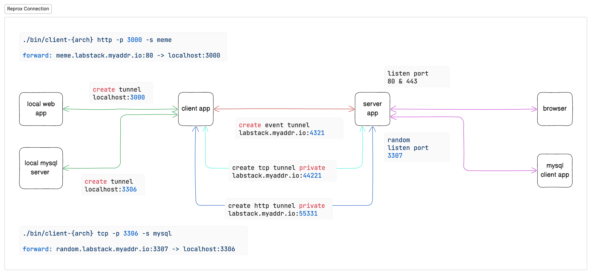

# REPROX

REPROX is a reverse proxy for http and tcp, insipired from
[JPRQ](https://github.com/azimjohn/jprq)

you can expose your home / private network to the public, share your local
website to the world

you can self hosted the server app using your own domain



more detail [here](./FLOW.md)

## Requirement

- domain or get a [free domain here](./FREE_DOMAIN.md)
- vps / server with public ip
- domain TLS certificates or you can generate free
  [letsencrypt certificate](./LETS_ENCRYPT.md)
- disable server firewall
- make server can accept tcp traffic from all port

## How to use

### Using Docker (Recommended)

- [Docker Image](https://hub.docker.com/repository/docker/jhonoryza/reprox)

- check `docker-compose.yml` file

```yaml
services:
  client:
    image: jhonoryza/reprox:client-linux-amd64
    container_name: reprox_client
    restart: unless-stopped
    # command: /app/client-cli tcp -p 5432 -t 5433 -s "pgsql"
    environment:
      DOMAIN: ${DOMAIN_NAME}
      DOMAIN_EVENT: ${DOMAIN_EVENT}
    network_mode: "host"

  server:
    image: jhonoryza/reprox:server-linux-amd64
    container_name: reprox_server
    restart: unless-stopped
    # command: /app/server-cli
    environment:
      DOMAIN: ${DOMAIN_NAME}
      DOMAIN_EVENT: ${DOMAIN_EVENT}
    network_mode: "host"
```

- set `command` in `docker-compose.yml` file with your custom command

- when using `host network_mode` it will expose PORT 80,443 & 4321 by default

- copy `.env.example` to `.env`

- set `DOMAIN_NAME` and `DOMAIN_EVENT`

- run `docker compose up -d server` on server machine

- run `docke compose up -d client` on client machine

- logging

```bash
docker logs -f reprox_client
# or
docker logs -f reprox_server
```

### Manual

- if you are using linux you can add to `/etc/environment` file
- or just in terminal run export ...

this is a required environment variables

example :

```
export DOMAIN=labstack.myaddr.io
export DOMAIN_EVENT=labstack.myaddr.io:4321
```

this is an optional environment variable

example :

```
export HTTP_PORT=80
export HTTPS_PORT=443

export TLS_PATH_CERT="/home/ubuntu/letsencrypt/certs/live/labstack.myaddr.io/fullchain.pem"
export TLS_PATH_KEY="/home/ubuntu/letsencrypt/certs/live/labstack.myaddr.io/privkey.pem"
```

if you dont specified port the default value will be used

if you dont specified tls file the https will be disabled automatically

### Compile Server App

```bash
./build.server.sh
```

check bin folder and choose the correct binary according to your arch

file is prefix with `server-`

### Compile Client App

```bash
./build.client.sh
```

check bin folder and choose the correct binary according to your arch

file is prefix with `client-`

### Notes

- every time the environment is changed, you need to recompile both apps

### Server App Usage

before using server app make sure the required environment variables is exported

replace arch with this

| arch          | description         |
| ------------- | ------------------- |
| linux-386     | linux 32bit         |
| linux-amd64   | linux 64bit         |
| linux-arm     | linux arm 32bit     |
| linux-arm64   | linux arm 64bit     |
| windows-386   | windows 32bit       |
| windows-amd64 | windows 64bit       |
| darwin-amd64  | mac with intel chip |
| darwin-arm64  | mac with arm chip   |

```bash
./bin/server-{arch}
```

### Client App Usage

before using client app make sure the required environment variables is exported

replace arch with this

| arch          | description         |
| ------------- | ------------------- |
| linux-386     | linux 32bit         |
| linux-amd64   | linux 64bit         |
| linux-arm     | linux arm 32bit     |
| linux-arm64   | linux arm 64bit     |
| windows-386   | windows 32bit       |
| windows-amd64 | windows 64bit       |
| darwin-amd64  | mac with intel chip |
| darwin-arm64  | mac with arm chip   |

#### command :

```bash
./bin/client-{arch} option
```

| option | description                  |
| ------ | ---------------------------- |
| -p     | local port                   |
| -s     | subdomain                    |
| -cname | different domain using CNAME |
| --dir  | directory path               |

For exposing any HTTP servers

```bash
./bin/client-{arch} http -p 3000 -s subdomain
```

For exposing any TCP servers, such as SSH

```bash
./bin/client-{arch} tcp -p 22 -s subdomain
```

Exposing on a different domain

```bash
./bin/client-{arch} http -p 3000 -cname example.com
```

Exposing directory static files using built-in HTTP Server

```bash
./bin/client-{arch} serve --dir . -s subdomain
```

Press Ctrl+C to stop

## Security

If you discover any security related issues, please create an issue.

## License

The MIT License (MIT). Please see [License File](LICENSE.md) for more
information.
